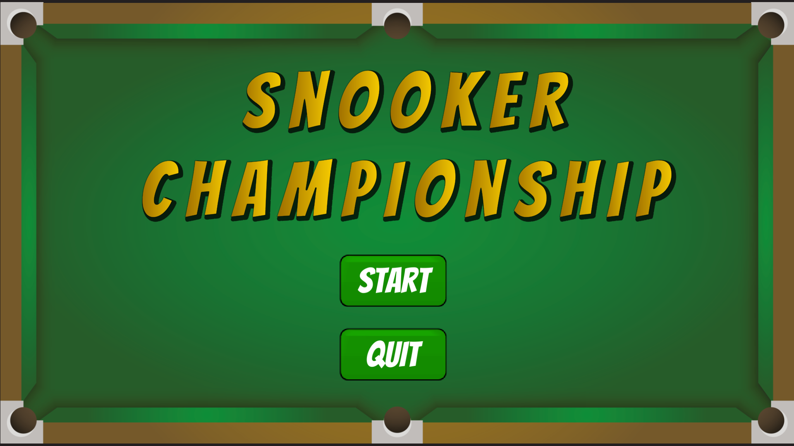

<h1 align = center> Competition-SnookerChampionship </h1>

<h2 align = center> Unity UI/UX Project </h2>

This Project demonstrates a snooker championship classification using Unity tools, all was thought to provide the "Real" player an immersive sensation of being part of this "virtual" game.

To make this Project I utilized:
## Unity
- [DotWeen](https://assetstore.unity.com/packages/tools/animation/dotween-hotween-v2-27676)
- [System.Linq](https://docs.microsoft.com/pt-br/dotnet/api/system.linq.enumerable.orderbydescending?view=net-6.0)
- [TM Pro](https://docs.unity3d.com/Manual/com.unity.textmeshpro.html)
- [2D Casual UI](https://assetstore.unity.com/packages/2d/gui/icons/2d-casual-ui-hd-82080)
- [3D Games Effect Pack](https://assetstore.unity.com/packages/vfx/particles/3d-games-effects-pack-free-42285)
- [SoundBits](https://assetstore.unity.com/packages/audio/sound-fx/soundbits-free-sound-fx-collection-31837)
## External Editors
- [Audacity](https://www.audacityteam.org/download/)
- Photoshop
- Adobe Illustrator

After click Start button, the set player menu will appear, here you can choose how many players will participate. Max 18 and Min 3, out of this range an error message will show.

When you set player the Main Board will appear and you will be capable of input the name of players.

 

Then when press "Play" the battleMenu will appear and plays the animation and sounds until the two players will be selected. In this Menu you can fill the spaces with the number
of balls and checkMark which player won.

 

When you click "Continue" we will return to MainBoard and the values will be changed according of the filled in the battleMenu. 

 

After all Players plays your games, when press "play" the Classification Menu will be appear. Here you can select how much players will be classifieds to the next phase. The classification consider firstly the table position and the number of victories, if its tie the number of balls will be the tie break.
If the value of classifieds is 2 the final will be started, if will higher than 2 all the game process will be repeated with one difference "the priority of classification nows follow the order in this classification and no more in table position". If occur any error a message will displayed.

 

The Final is better of 5, then the player which reach 3 wins first will win the championship.

 

When the final ends, the championMenu will be displayed and the  firework particles and final animation will shown.

